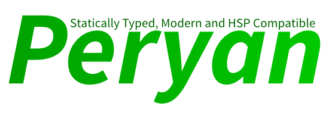

## Peryanについて

Peryanによって書かれたエラトステネスのふるい(1000より小さい素数を列挙)

    var length = 1000
    
    var table = [Bool](length, true)
    
    table[0] = false
    table[1] = false
    
    repeat length
    	if table[cnt] == false : continue
    
    	var cnt_ = cnt
    	var cur = cnt_ + cnt_
    
    	repeat
    		cur += cnt_
    		if !(cur < length) : break
    
    		table[cur] = false
    	loop
    loop
    
    repeat length
    	if table[cnt] : mes String(cnt)
    loop

Peryanは以下のような目標を持つプログラミング言語です。

* 強い静的型付けとLLVMを用いた静的コンパイル
* オブジェクト指向を含む現代的な言語機能
* HSPとの互換性

Peryanは、これらの目標を達成することにより、高い実用性を持った言語となる事を目指しています。

## 処理系のコンパイル

処理系はSTLのみを利用するC++で書かれており、コンパイルにはLLVMが必要です。
ただし、Peryanによって実行ファイルを出力する場合にはClangも必要です。

    make
    make test

## PeryanによるPeryanプログラムのコンパイル

    cd src
    make
    PERYAN_RUNTIME_PATH=../runtime ./peryan ../test/integration/cases/Sieve.pr sieve
    ./sieve

## 文法概観

### 関数定義

    func thisIsFunction (arg1 :: Int, arg2 :: Double, arg3 :: String) :: Int {
    	thisIsStatement
    	return 0
    }

### 変数定義

    var thisIsVariable :: Int = 123

ただし型推論の有効な範囲内で型名を省略することができます。

## 今後の展望

Peryanではオブジェクト指向など多くの機能が未だ実装されずに残っています。
今後実装される予定の物には以下のものがあります。
また、詳細なドキュメントも今後用意される予定です。

* 本格的な型推論器
* オブジェクト指向
* variant型
* パターンマッチ
* クロージャ
* 部分適用
* ガード
* 各種HSP互換機能
* ランタイムライブラリ
* コルーチン

## 処理系のコードについて

処理系のコードはメモリをまともに解放しない、頻繁にSegmentation Faultで落ちるなど、ひどい出来です。
アドバイス等ございましたら、@peryaudoまでお伝え頂けると非常に助かります。

## ライセンス

Peryanの処理系はMITライセンスの下に提供されます。詳しくはLICENSEを御覧ください。
また、test/unit/gtest/下のGoogle Testは新BSDライセンスの下に提供されます。詳しくはtest/unit/gtest/COPYINGを御覧ください。

## 参考文献

* 柏木 餅子, 風薬 『きつねさんでもわかるLLVM　〜コンパイラを自作するためのガイドブック〜』 2013年
* (著) Terence Parr, (監訳) 中田 育男, (訳) 伊藤 真浩 『言語実装パターン』 2011年

